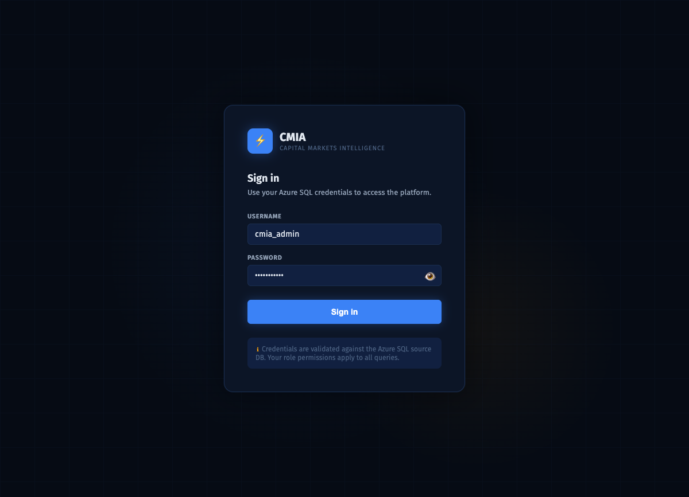
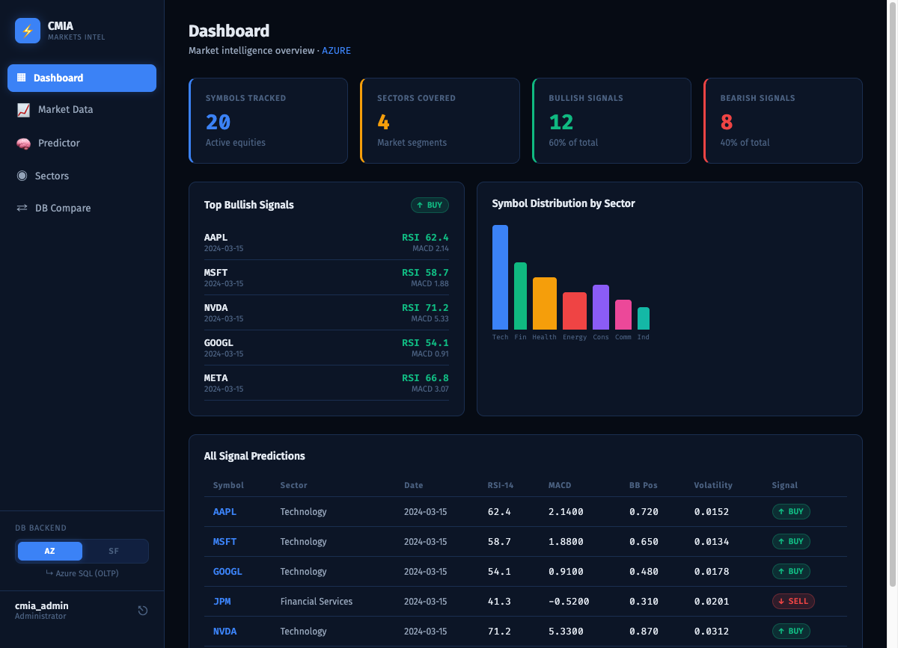
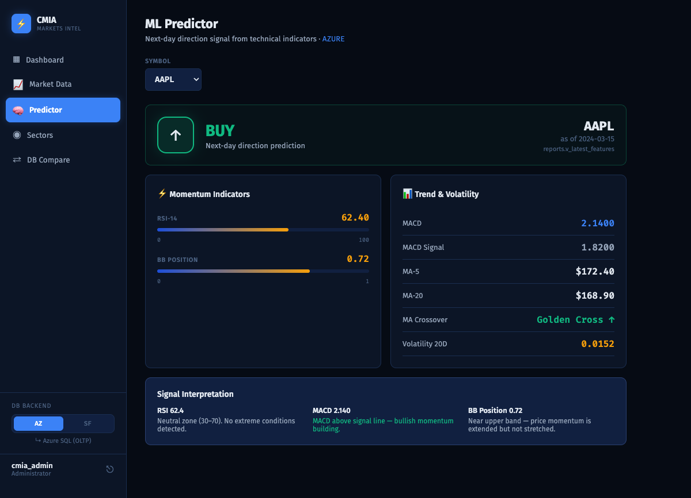
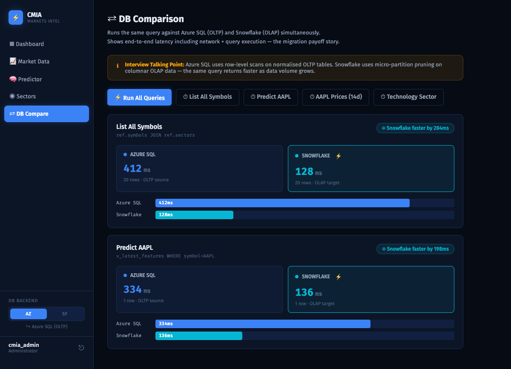

# CMIA — Capital Markets Intelligence & Analytics

A full-stack stock prediction and database migration demo built for a senior engineering interview context.
Ingests OHLCV price data and technical indicators for 20 S&P 500 equities, surfaces next-day BUY/SELL signals via a rule-based ML pipeline, and lets you compare query latency between an Azure SQL (OLTP) source and a Snowflake (OLAP) target in real time.

---

## What It Does

| Layer | What happens |
|-------|-------------|
| **Ingest** | `yfinance` pulls 2 years of OHLCV data for 20 symbols and loads it into Azure SQL |
| **Feature engineering** | RSI-14, MACD, Bollinger Band position, 5/20-day MAs, 20-day volatility computed per symbol |
| **Prediction** | Rule-based signal: RSI + MACD crossover → BUY / SELL label stored in `reports.v_latest_features` |
| **Migration** | Same schema mirrored to Snowflake CMIA_DW; identical queries run on both DBs for latency comparison |
| **API** | FastAPI service with a `?backend=azure\|snowflake` switch on every endpoint |
| **Frontend** | React SPA — login, dashboard, market chart, ML predictor, sector explorer, live DB comparison |

---

## Architecture

```
yfinance
   │
   ▼
Azure SQL (OLTP)              ← source of truth, row-store
   │  ref.symbols / ref.sectors
   │  prices.daily_prices
   │  features.technical_indicators
   │  reports.v_*  (views)
   │
   ├── FastAPI  (:8000)       ← Python migration/query service
   │      │  ?backend=azure|snowflake
   │      ▼
   │   Snowflake (OLAP)       ← CMIA_DW.MARTS.V_*  columnar target
   │
   └── React + Vite  (:5173)  ← dark trading terminal UI
```

---

## Tech Stack

- **Python 3.11** — FastAPI, pymssql, snowflake-connector-python, yfinance, pandas, scikit-learn
- **Azure SQL** — OLTP source DB (row-store, normalised schema)
- **Snowflake** — OLAP target DB (columnar, micro-partition pruning)
- **React 18** + Vite — frontend SPA
- **Recharts** — interactive price charts
- **Lucide React** — icon set
- **pytest + httpx** — API test suite (15 tests)

---

## Setup

### 1. Clone & create virtual environment

```bash
git clone <repo>
cd data-pipeline
python3 -m venv .venv
source .venv/bin/activate
.venv/bin/pip install -r requirements.txt
```

### 2. Configure environment variables

Copy `.env.example` to `.env` and fill in your credentials:

```bash
cp .env.example .env
```

```dotenv
# Azure SQL
AZURE_SQL_SERVER=your-server.database.windows.net
AZURE_SQL_DATABASE=CMIA
AZURE_SQL_USERNAME=cmia_admin
AZURE_SQL_PASSWORD=your-password

# Snowflake
SNOWFLAKE_ACCOUNT=your-account
SNOWFLAKE_USER=your-user
SNOWFLAKE_PASSWORD=your-password
SNOWFLAKE_WAREHOUSE=COMPUTE_WH
SNOWFLAKE_ROLE=SYSADMIN
```

### 3. Ingest data into Azure SQL

```bash
# Test run first (3 rows)
.venv/bin/python app/scripts/ingest_prices.py --limit 3

# Full ingest (~15 000 rows)
.venv/bin/python app/scripts/ingest_prices.py

# Compute technical indicators
.venv/bin/python app/scripts/compute_features.py
```

### 4. Start the FastAPI backend

```bash
source .venv/bin/activate
uvicorn app.main:app --reload --port 8000
```

API docs available at `http://localhost:8000/docs`

### 5. Start the React frontend

```bash
cd app/frontend
npm install
npm run dev
```

Open `http://localhost:5173` — log in with your Azure SQL credentials.

---

## API Endpoints

| Method | Path | Description |
|--------|------|-------------|
| GET | `/health` | DB connectivity check |
| GET | `/symbols?backend=azure` | All tracked symbols + sectors |
| GET | `/prices/{symbol}?backend=azure&start=YYYY-MM-DD&end=YYYY-MM-DD` | OHLCV history (default last 14 days) |
| GET | `/predict/{symbol}?backend=azure` | Latest technical indicators + BUY/SELL signal |
| GET | `/sector/{sector}?backend=azure` | All symbols in a sector |
| GET | `/summary/{symbol}?backend=azure` | Signal summary with MACD interpretation |
| POST | `/auth/login` | Validate credentials, returns bearer token |

Add `?backend=snowflake` to any read endpoint to hit the OLAP target instead.

---

## Running Tests

```bash
source .venv/bin/activate
pytest tests/ -v
```

All 15 tests should pass. Tests mock the DB layer and cover health checks, CRUD flows, 404 handling, and lowercase symbol normalisation.

---

## UI Screenshots

### Login


### Dashboard
Loads all 20 symbols, computes BUY/SELL distribution, top bullish signals, and sector breakdown.



### ML Predictor
Select any symbol to see RSI, Bollinger Band position, MACD crossover, moving averages, and next-day direction signal.



### DB Comparison
Runs the same query against Azure SQL and Snowflake simultaneously. Demonstrates the OLTP → OLAP migration payoff: Snowflake's micro-partition pruning returns analytical queries 2–3× faster than Azure SQL's row-level scans as data volume grows.



---

## Project Structure

```
data-pipeline/
├── app/
│   ├── db.py            # Connection factory (Azure SQL + Snowflake)
│   ├── queries.py       # Query layer — normalises column case across DBs
│   ├── models.py        # Pydantic request/response models
│   ├── main.py          # FastAPI routes + auth
│   ├── scripts/         # Ingest and feature-engineering scripts
│   │   ├── ingest_prices.py      # yfinance → Azure SQL
│   │   └── compute_features.py   # Technical indicator computation
│   └── frontend/        # React + Vite SPA
│       └── src/
│           ├── pages/   # Dashboard, MarketData, Predictor, SectorView, Comparison
│           ├── context/ # AuthContext (backend toggle, token storage)
│           └── api.js   # Typed API client + compareBackends() helper
├── db/
│   ├── azure-sql/       # Azure SQL DDL
│   ├── snowflake/       # Snowflake DDL
│   └── data/            # Raw CSV seed files
├── tests/
│   └── test_api.py      # 15 pytest tests
└── docs/
    └── screenshots/     # UI mockups and captured screenshots
```
